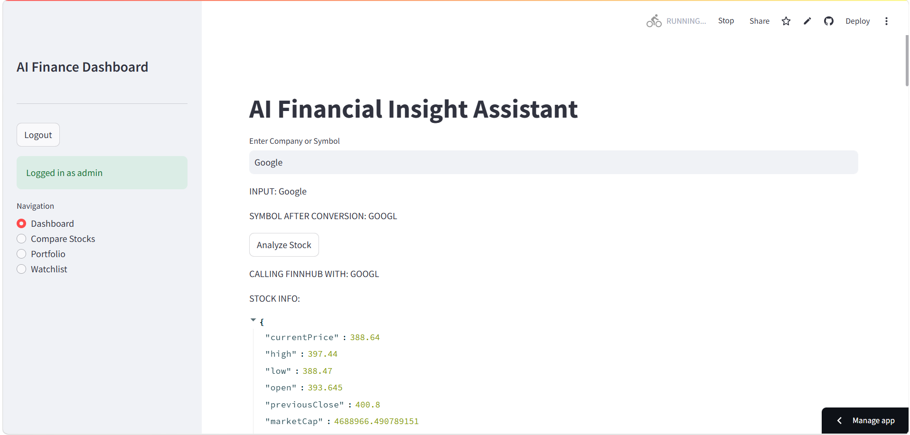
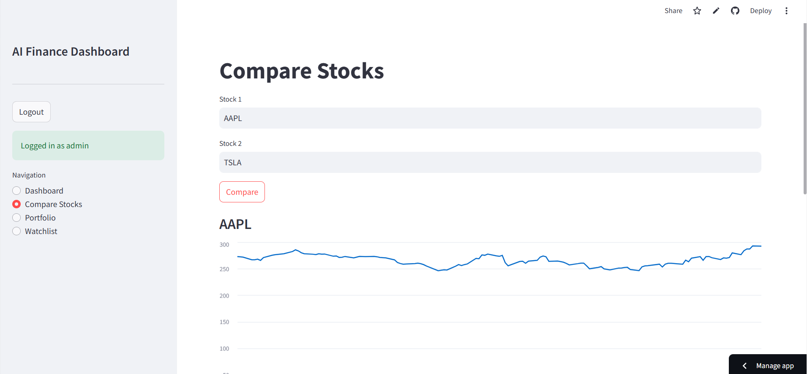
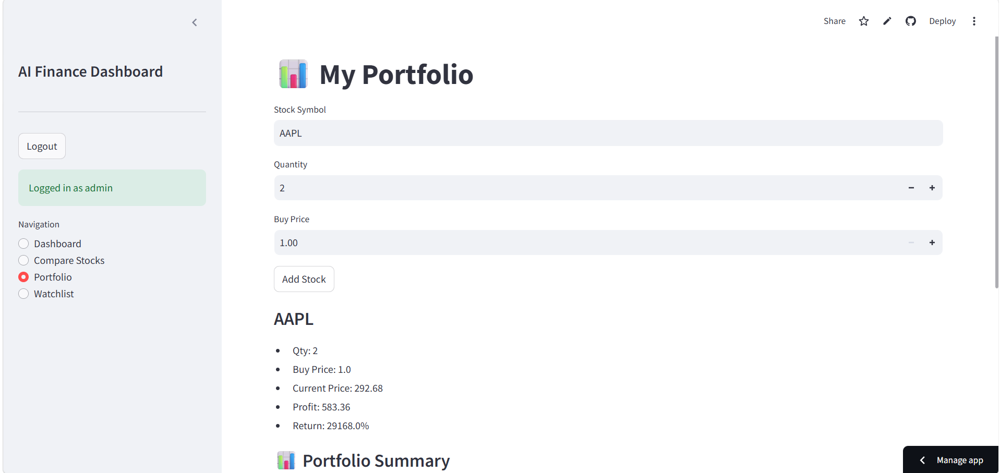
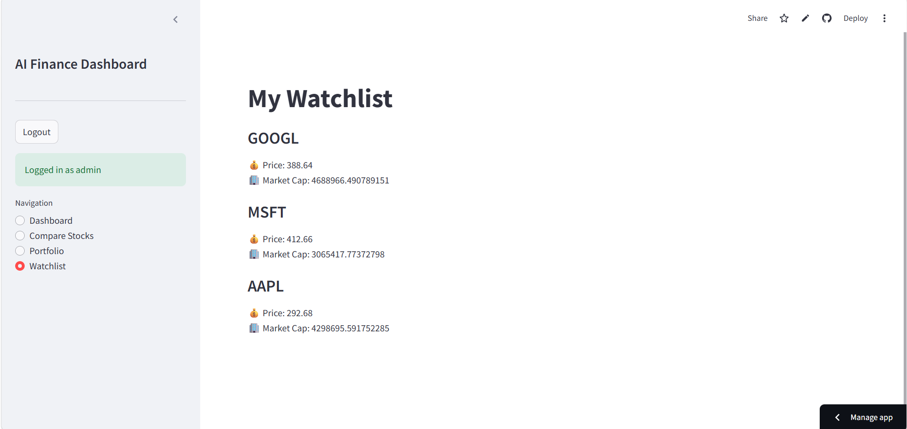

# 📊 AI Financial Insight Assistant

---

## Test Login

Email Id :

```bash
admin@gmail.com
```

Password:

```bash
admin@123
```

---

An AI-powered stock market analysis web app built using **Streamlit**, **Firebase**, and **Google Gemini API**.  
It helps users analyze stocks, view technical indicators, read market sentiment, and get AI-driven insights in real time.

---

## 🚀 Live Demo

👉 Add your Streamlit link here after deployment  

- [AI-Financial-Insight-Assistant](https://aifinancialinsightappgdg-ggccjxe9qq2ypjhvq8fjfd.streamlit.app/)

---

## 🧠 Features

### 📈 Stock Analysis

- Real-time stock data fetching
- Company name → automatic symbol detection (AI-assisted)
- Historical price charts (Line + Candlestick)

### 📊 Technical Indicators

- RSI (Relative Strength Index)
- MACD
- SMA (Simple Moving Average)
- EMA (Exponential Moving Average)

### 📰 News & Sentiment

- Latest stock-related news
- Sentiment analysis:
  - Positive %
  - Negative %
  - Neutral %

### 🤖 AI Insights (Gemini API)

- Market explanation in simple language
- Buy / Sell / Hold suggestions
- Human-friendly financial interpretation

### ❤️ Watchlist (Firebase)

- Add stocks to personal watchlist
- Stores per user in Firestore
- Persistent across login sessions

### 💼 Portfolio Tracker

- Add stocks with quantity & buy price
- Basic investment tracking

### 🔐 Authentication (Firebase Auth)

- Email & password login system
- New user signup
- Session-based login (Streamlit state)

---

## Guide Image









---

## 🧾 How It Works

### 1. User Login

- User signs up or logs in using Firebase Authentication
- Session is stored using `st.session_state`

---

### 2. Stock Input

User can enter:

- Company name (e.g., Apple, Tesla, TCS)
- OR stock symbol (e.g., AAPL, TSLA, TCS.NS)

AI converts it into valid stock symbol.

---

### 3. Data Fetching

- Stock data fetched using financial APIs
- Historical price data loaded into Pandas DataFrame

---

### 4. Indicator Calculation

Technical indicators are calculated:

- RSI → momentum strength
- MACD → trend direction
- SMA / EMA → trend smoothing

---

### 5. AI Analysis

Gemini API generates:

- Market explanation
- Trend interpretation
- Buy/Sell/Hold suggestion

---

### 6. Watchlist System

- Stored in Firebase Firestore
- Structure:

users/
user_id/
watchlist/
AAPL/
TSLA/

---

### 7. Portfolio Tracking

- Stores user investments locally (can be upgraded to Firebase)
- Tracks:
  - Symbol
  - Quantity
  - Buy price

---

## ⚙️ Tech Stack

- 🐍 Python
- 🎈 Streamlit
- 🔥 Firebase (Auth + Firestore)
- 🤖 Google Gemini API
- 📊 Pandas, Plotly
- 📰 News APIs

---

## 📁 Project Structure

```bash
AI-Financial-Insight-Assistant
├── 📁 ai
│   ├── 🐍 gemini_analysis.py
│   └── 🐍 symbol_ai.py
├── 📁 assets
│   ├── 🖼️ compare.png
│   ├── 🖼️ dashboard.png
│   ├── 🖼️ portfolio.png
│   ├── 🎨 style.css
│   └── 🖼️ watchlist.png
├── 📁 charts
│   └── 🐍 chart_builder.py
├── 📁 firebase
│   ├── 🐍 auth_service.py
│   ├── 🐍 firebase_config.py
│   └── 🐍 watchlist_service.py
├── 📁 indicators
│   └── 🐍 indicators.py
├── 📁 services
│   ├── 🐍 compare_service.py
│   ├── 🐍 export_service.py
│   ├── 🐍 news_service.py
│   ├── 🐍 portfolio_service.py
│   ├── 🐍 sentiment_service.py
│   └── 🐍 stock_service.py
├── ⚙️ .gitignore
├── 📝 Readme.MD
├── 🐍 app.py
└── 📄 requirements.txt
```

---

## 🔐 Environment Variables

Stored securely in Streamlit Secrets:

```toml
FIREBASE_API_KEY = "..."
FIREBASE_AUTH_DOMAIN = "..."
FIREBASE_PROJECT_ID = "..."
FIREBASE_STORAGE_BUCKET = "..."
FIREBASE_MESSAGING_SENDER_ID = "..."
FIREBASE_APP_ID = "..."
FIREBASE_DATABASE_URL = "..."
```

---

### 🚨 Rules / Constraints

- Do NOT hardcode API keys in code
- Firebase credentials must be stored in secrets
- Watchlist is user-specific (based on Firebase UID)
- Portfolio is currently local (can be upgraded)
- Invalid stock symbols return "Company not found"
- AI suggestions are NOT financial advice

### 📌 Future Improvements

- 🔔 Real-time price alerts
- 📊 Portfolio profit/loss tracking
- 🧠 Better stock symbol auto-correction using Gemini
- 🌐 Global stock exchange support
- 📱 Mobile-friendly UI improvements
- 📈 Advanced prediction models (ML/DL)

### ⚠️ Disclaimer

This project is for educational purposes only.
It does not provide financial advice. Always verify before investing.

### 👨‍💻 Author

Built by: AI Financial Insight Project
Powered by: Streamlit + Firebase + Gemini API

---
